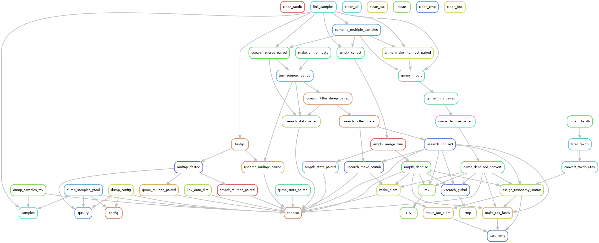

# Target rules ("commands")

## Rule graph

## List of rules

The following rules

- **config**: Allows checking the configuration by creating the files `results/samples.yaml` and `<pipeline>/config.yaml`. `samples.yaml` lists the sample names and the corresponding input files ([example](test/results/samples.yaml)). This is useful to check if the `input` settings in `config/config.yaml` are specified correctly. The `config.yaml` files contain the final configuration of each pipeline used internally (slightly modified, structure may change with later versions) ([example](test/results/unoise/config.yaml)). This is especially useful to check, whether additional settings specified in the `pipelines` definition in `config/config.yaml` correctly override the default settings.
- **quality**: Runs [FastQC](https://www.bioinformatics.babraham.ac.uk/projects/fastqc) and [MultiQC](https://multiqc.info) (output in `results/_validation`). This can be done in a first step before deciding on the quality filtering/trimming options in `config/config.yaml`.
- **denoise**: Does the denoising (clustering) for all pipelines, as specified in `config/config.yaml`. The results are normally found in `results/<pipeline>/data`, unless the input files contain both paired and single-end (different "sequencing strategies"), or multiple primer combinations are specified. In this case, the output path is `results/<pipeline>/pipeline_.../<primers>/<strategy>`. The denoised/clustered sequences are in `denoised.fasta`, the OTU table is stored in flat text format (`denoised_otutab.txt.gz`) and BIOM (`denoised.biom`). In addition, a sample report with read numbers retained in each step is placed in `results/<pipeline>/pipeline_.../_validation`, along with another MultiQC report including Cutadapt statistics (currently only UNOISE pipeline).
- **taxonomy**: Assigns taxonomic labels to denoised/clustered sequences. Several methods can be specified in `config/config.yaml`. The output files are in the `taxonomy` subdirectory of the directory containing the FASTA and OTU tables. The file names are as follows `<ref. database>-<assignment method>-<assignment name>.txt.gz`. In addition, a GZIP-compressed BIOM file is created.
- **cmp**: Runs sequence comparisons with files listed in `config/config.yaml` (`compare` key). The comparisons are done with VSEARCH, using the denoised FASTA as query and the given sequence files as database. The result is a tab-delimited mapping file (with corresponding name) with three columns: query (ASV/OTU), target (from custom sequence database), percent identity (edit distance excluding terminal gaps in the alignment, see also --iddef option). FASTA files of both the non-matched query and database sequences are also created, as well as a BAM file, which allows viewing/extracting the alignments of query and target sequences.
- **ITS**: Runs [ITSx](https://microbiology.se/software/itsx) to recognize rDNA domains (or parts of them) and locate the internal transcribed spacer (ITS) regions. The information from the positions file (`ITSx/out.positions.txt`) is used to distinguish "true" ITS sequences from possible unspecific amplification (see also [example analysis](test/R_example/example.md#read-data)).

Finally, there are commands for cleaning up:

- **clean**: Removes the working directories `input` and `processing`. The `results` and `logs` directories are retained.
- **clean_all**: Cleans up everything (including the pipeline output), except for taxonomic reference databases. This is only used to completely remove all output from a target directory.
- **clean_tax**: Removes the `refdb` directory
