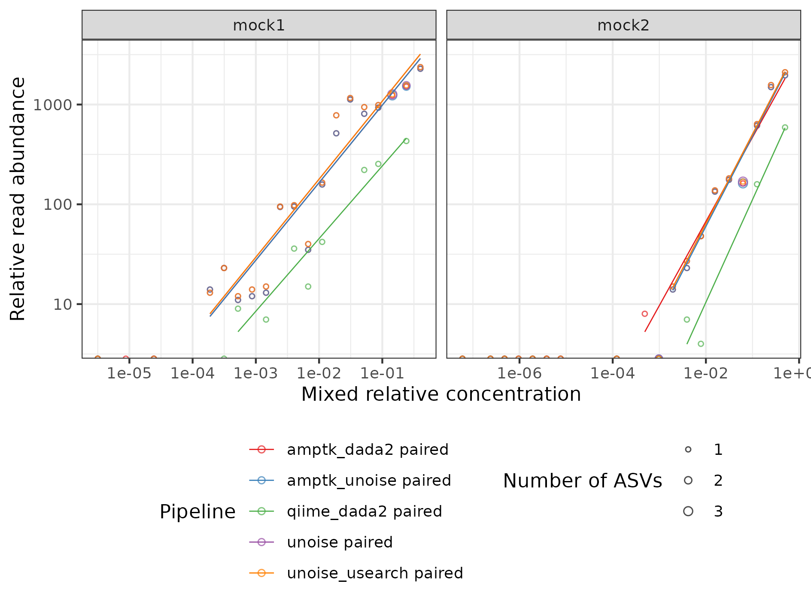

# Test data

The directory `test/gz` contains example files from an Illumina MiSeq run of two uneven (staggered) mock communities (Schlegel et al. 2018). A subset of 5000 reads is stored in the files. Another 5000 reads from the first uneven community (mock1) are in separate files in `mock1_more` directory to showcase the automatic merging of files with the same name. Due to the reduced sequencing depth, only the more abundant species in the community are found. Still, this dataset is useful for validating the pipelines and their parameter combinations.

## How to analyze

These commands run all the clustering pipelines (on a local computer) and compare the results.

```sh
conda activate snakemake
# run the denoising with 6 cores
snakemake -j 6 --use-conda --conda-prefix ~/conda -d test denoise cmp
# (optional) remove working directories (but not logs)
snakemake -j1 -d test clean
# run a general comparison script (useful for any pipeline comparison)
# (creates Excel file in test/cmp)
scripts/compare_results.sh test
# compare obtained ASVs with mixed gDNA concentrations (see test/mock_cmp/...)
cd test
scripts/compare_mock.R
# this command will remove everything (including the results/ directory)
# snakemake -j1 -d test clean_all
```

The results of the comparison are found in `test/mock_cmp`. If rerunning the pipeline several times (with code modifications), consider supplying `--rerun-incomplete --rerun-triggers mtime` to snakemake. The mock community is fairly well represented by the UNOISE, Amptk/UNOISE and Amptk/Dada2 pipelines, while QIIME2 looses many reads due to quality filtering. Using this pipeline with variable-length ITS reads seems difficult.




## Reference

Schlegel, M., Queloz, V., and Sieber, T. N. (2018). The endophytic mycobiome of European ash and sycamore maple leaves – geographic patterns, host specificity and influence of ash dieback. *Frontiers in Microbiology* 9. doi: 10.3389/fmicb.2018.02345.
